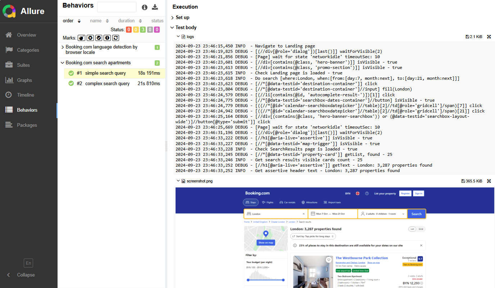
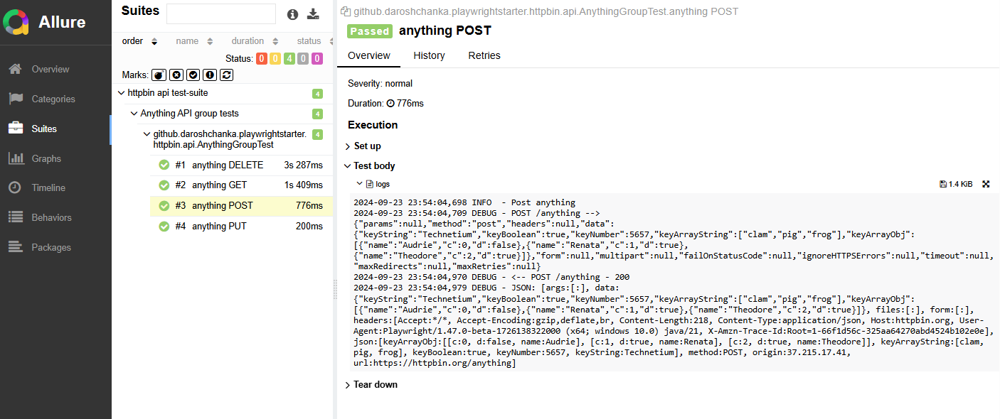

## playwright-groovy-starter

Test automation project boilerplate including packages structure, reporting, logging, multi-env run configuration for
WEB and API test automation.

Pure Playwright APIs wrapped a little to add more logs/traceability to test execution and to make theirs usage
less-verbose in tests.

#### Built with

| Type               | Tool/lib     |
|--------------------|--------------|
| Lang               | Groovy (JVM) |
| Build/Management   | Maven        |
| Web/API Automation | Playwright   |
| Test Runner        | TestNG       |
| Logger             | Log4j2       |
| Reporting          | Allure       |

### Project Structure

- `src/main/../core`  - project-agnostic code, common for any product/project to be automated
- `src/main/../project`  - project-specific base code, including objects and utils for the particular project (
  pageobjects for web, services for api, utils, datagenerators, etc.)
- `src/test/` - project tests, grouped by directories, components, etc. also test config definition is there (base urls,
  etc.)

### Quick Start

- `./mvnw clean test -Dsuite-name=health-check` - run `src/test/resources/suites/health-check.xml` tests
- `./mvnw allure:serve` - show test report

#### Explore examples:

- WEB automation: `src/main/../project/booking/`, `src/test/../booking/`
- API automation: `src/main/../project/httpbin/`, `src/test/../httpbin/`

#### Run tests

```shell
./mvnw clean test -Dsuite-name=httpbin -DENV=dev
```

```shell
./mvnw clean test -Dsuite-name=booking -DENV=dev -Dplaywright-browser=chrome -Dheadless=true -Dthread-count=3
```

#### Reporting

Allure report used.
Customization added to attach text logs + screenshot per each test.

- `./mvnw allure:report` - will generate report to `target/site` (for CI)
- `./mvnw allure:serve` will generate report to temp directory and will open it in browser (local).




### Configuration

`src/test/resources/playwright-config.yaml` contains project-agnostic Playwright configs.

Example:

```yaml
reporting:
  attach-screenshots: 'on' # on, off, only-on-failure
  screenshot-mode: 'viewport' # full, viewport

base:
  launch-options: &base-launch-options
    slowMo: 100
    headless: ${headless}
  new-context-options: &new-context-options
    viewportSize:
      width: 1920
      height: 1080
    extraHTTPHeaders: #workaround for HeadlessChrome not to be passing automatically
      user-agent: 'Mozilla/5.0 (Windows NT 10.0; Win64; x64) AppleWebKit/537.36 (KHTML, like Gecko) Chrome/129.0.0.0 Safari/537.36'

browser:
  - name: 'chrome'
    type: 'chromium'
    launch-options: &chromium-launch-options
      <<: *base-launch-options
      channel: 'chrome'
      args:
        - '--disable-dev-shm-usage'
        - '--disable-blink-features=AutomationControlled'
      ignoreDefaultArgs:
        - '--disable-component-extensions-with-background-pages'
    new-context-options:
      <<: *new-context-options

  - name: 'webkit'
    type: 'webkit'
    launch-options:
      <<: *base-launch-options
    new-context-options:
      <<: *new-context-options

  - name: 'firefox'
    type: 'firefox'
    launch-options:
      <<: *base-launch-options
    new-context-options:
      <<: *new-context-options

  - name: 'msedge'
    type: 'chromium'
    launch-options:
      <<: *chromium-launch-options
      channel: 'msedge'
    new-context-options:
      <<: *new-context-options
```

to use the browser config in tests `playwright-browser` system variable should be provided.

#### Multi-env configuration

In the examples `ENV` system variable used to figure out the proper test configs.

```groovy
class BookingTestConfig {

  private Map envConfigs

  private BookingTestConfig() {
    def env = System.getProperty('ENV') ?: 'dev'
    ...
```

Unknown or missing env value will be mapped to `dev`.

`src/test/resources/booking-config.yaml` contains project-specific configs. e.g. base urls, etc.

Example:

```yaml
dev:
  api:
    baseUrl: 'https://www.api.booking-dev.com'
  web:
    baseUrl: 'https://www.booking-dev.com'

qa:
  api:
    baseUrl: 'https://www.api.booking-qa.com'
  web:
    baseUrl: 'https://www.booking-qa.com'

stage:
  api:
    baseUrl: 'https://www.api.booking-stage.com'
  web:
    baseUrl: 'https://www.booking-stage.com'
```

### Other Implementations

- [playwright-typescript-starter](https://github.com/daroshchanka/playwright-typescript-starter)